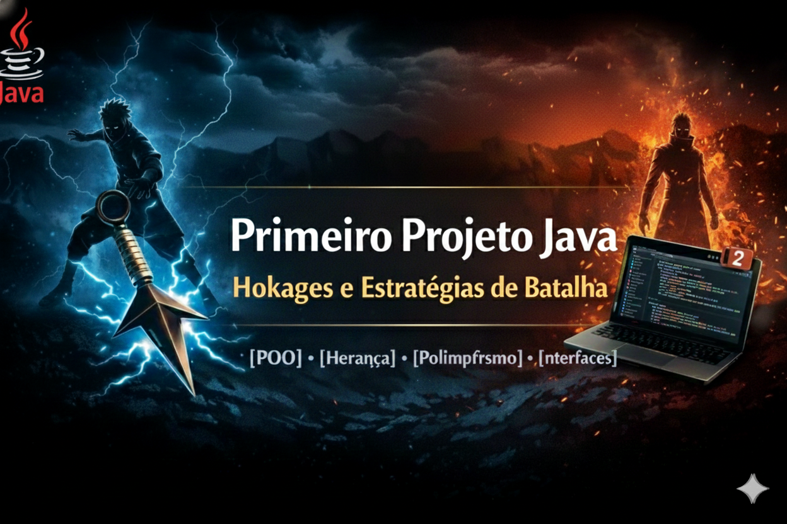

<p align="center">
  
</p>

# 🥷 Projeto Java — Hokages e Estratégias de Batalha

Projeto desenvolvido em **Java** com foco em **Programação Orientada a Objetos**, utilizando personagens do universo Naruto para aplicar conceitos fundamentais usados no mercado.

## 🧠 Conceitos aplicados
- Programação Orientada a Objetos (POO)
- Herança
- Polimorfismo
- Classes abstratas
- Interfaces
- Sobrescrita de métodos (`@Override`)
- Uso de `this` e `super`

## 🏗️ Estrutura do projeto
- `Hokages` → Classe abstrata base
- `Hashirama` e `Minato` → Classes filhas
- `EstrategiaDeBatalha` → Interface
- `Main` → Classe de execução

## ⚔️ Funcionamento
Cada Hokage possui:
- Nome
- Idade
- Habilidade especial
- Estratégia de batalha personalizada

O comportamento varia de acordo com a implementação de cada classe filha, demonstrando **polimorfismo**.

## 🛠️ Tecnologias utilizadas
- Java
- IntelliJ IDEA
- Git & GitHub

## ▶️ Como executar
1. Clone o repositório:
```bash
git clone https://github.com/seu-usuario/nome-do-repositorio
